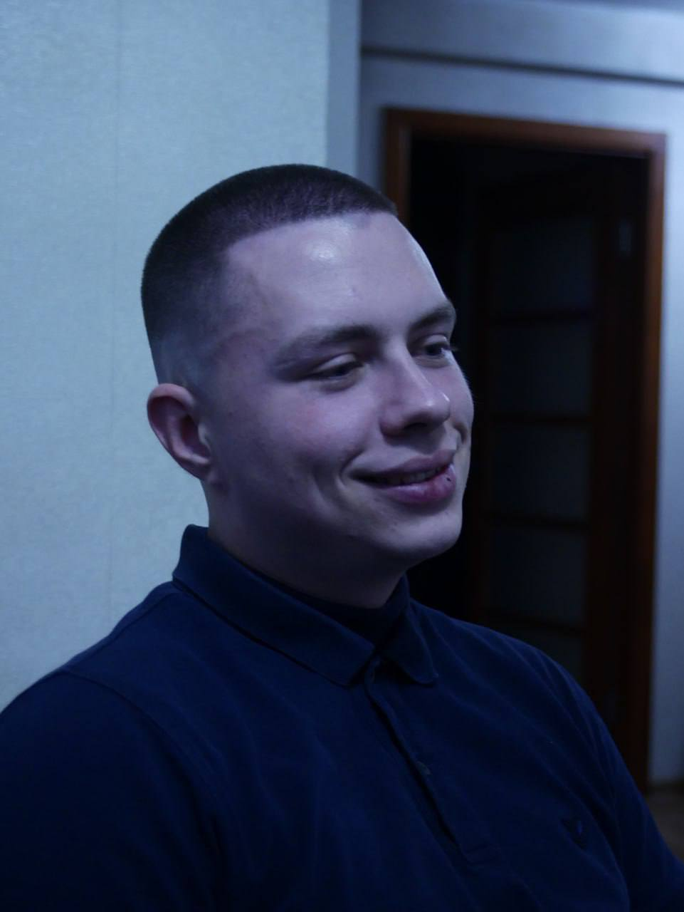

# Дубровский Максим Дмитриевич



## Контакты

- Email: dubrovskij.dev@gmail.com
- Telegram: [@mdubr0vsky](https://t.me/mdubr0vsky)
- Discord: davidd (@macik-dev)
- GitHub: [macik-dev](https://github.com/macik-dev)

## О себе

Ищу работу junior frontend-разработчиком. Сейчас учусь в The Rolling Scopes School: HTML, CSS, JavaScript.

До этого два года писал скрипты на Luau и два года работал системным администратором. Умею читать чужой код, искать причину ошибки и доводить задачу до рабочего результата. Понимаю, как устроены серверы, сети и почему что-то перестаёт работать. Параллельно с учёбой преподаю программирование на Luau.

Хочу работать в команде над реальными проектами и расти в веб-разработке.

## Навыки

- HTML5, семантическая вёрстка
- CSS3, flexbox, адаптивная вёрстка
- JavaScript (основы, изучаю)
- Lua / Luau
- Git, GitHub, GitHub Pages
- Markdown
- Администрирование Linux и Windows Server
- Настройка серверов и сетевой инфраструктуры
- VS Code, Chrome DevTools

## Пример кода

Задача [Multiply](https://www.codewars.com/kata/50654ddff44f800200000004) с Codewars. В исходной функции была ошибка, её нужно было найти и исправить.

```javascript
function multiply(a, b) {
  return a * b;
}

console.log(multiply(3, 4)); // 12
console.log(multiply(-2, 5)); // -10
```

## Опыт работы

### Разработчик на Luau, 2 года

Писал скрипты и модули для внутренних и прикладных проектов. Автоматизировал повторяющиеся процессы, реализовывал логику приложений, правил и оптимизировал существующий код.

### Системный администратор, 2 года

Настраивал и обслуживал серверы, поддерживал инфраструктуру компании. Занимался резервным копированием, правами доступа, диагностикой инцидентов и поддержкой пользователей.

### Репетитор по программированию на Luau, по настоящее время

Веду индивидуальные занятия: объясняю основы языка, разбираю с учениками алгоритмические задачи, проверяю их код и составляю программу под уровень ученика.

## Проекты

- rsschool-cv - это резюме в виде страницы на HTML и CSS, задеплоено на GitHub Pages. [Код](https://github.com/macik-dev/rsschool-cv) / [Страница](https://macik-dev.github.io/rsschool-cv/)

## Образование

Ошмянский государственный аграрно-экономический колледж
Программное обеспечение вычислительной техники и автоматизированных систем
Среднее специальное, 2023

The Rolling Scopes School, курс JavaScript/Frontend, обучение идёт сейчас

## Английский язык

Уровень A2. Читаю техническую документацию и учебные материалы со словарём. Продолжаю учить, цель - читать документацию свободно и вести рабочую переписку.
